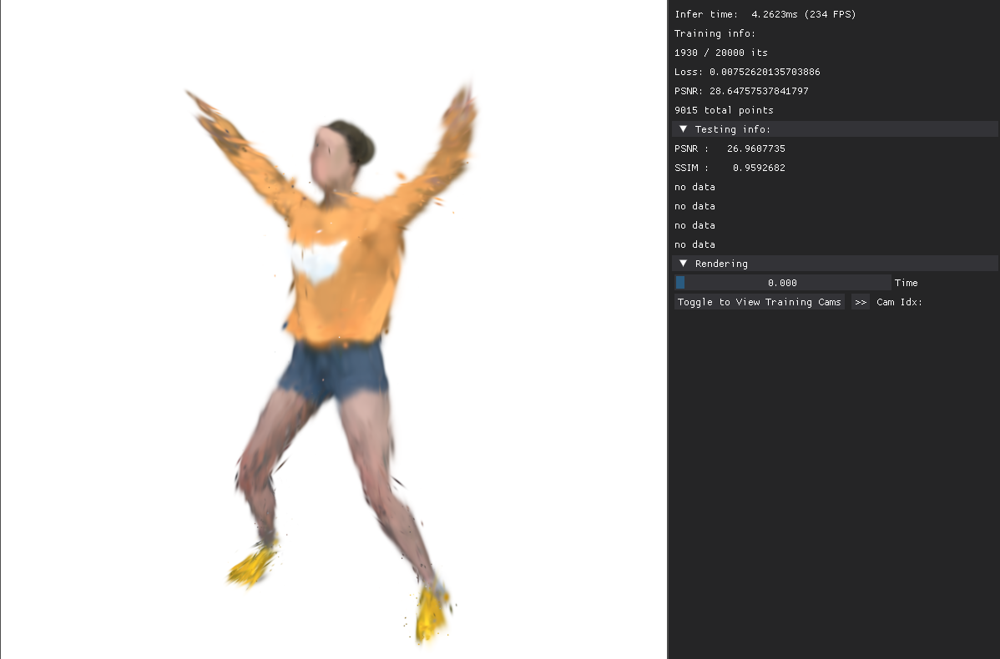
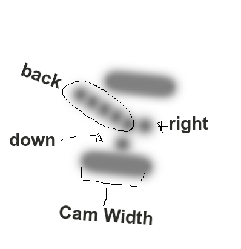
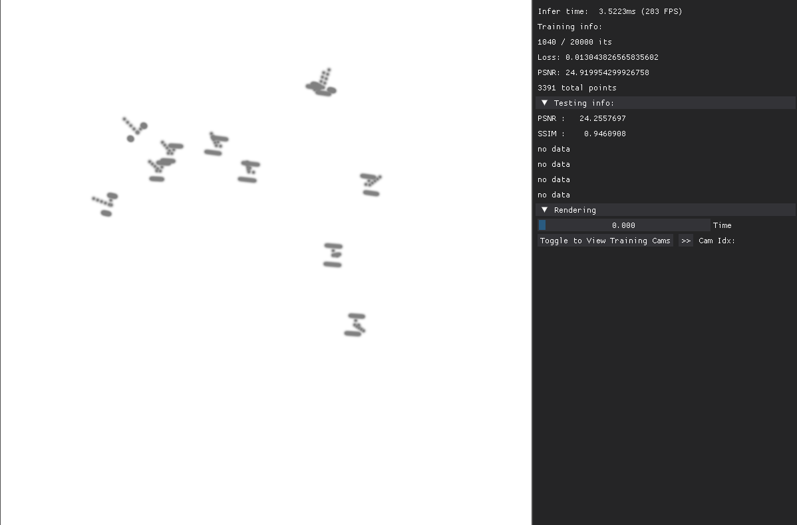

### Fork of the [4D-GS](https://arxiv.org/abs/2310.08528) model for 4-D view synthesis with real-time view (using [dearpygui](https://github.com/hoffstadt/DearPyGui)) and visual debugging for custom data sets.

Currently and forever "under contruction" as I will likely use this for validating custom datasets used in 4DGS modelling.

Done:
- Real-time scene viewer
- Control for Time
- Display testing metrics (PSNR and SSIM during training and all metrics at the end of training)
- Toggle to view training view + loop through each view using `>>` button
- View up-to 10 training camera locations (for visually verifying the correct pose/coordinate system)


TODO:
- [ ] View more than 10 cameras (For static-cameras we should load a single pose rather than all poses in time) (likely solved by solving below first)
- [X] Integrate viewing training cameras with scene (so viewing trained scene and training poses simulateneously)
- [ ] Color the camera model orientations (need to determine how to show colour w.r.t to spherical harmonics)
- [ ] Need to add inputs for training from custom viewer (to over ride configs)
- [-] Orbit control from training camera (When viewing training cam give orbital control so we can see whether a view is over-fitting)


Notes on 4DGS that may/may not have been initially provided:
- OpenCV/COLMAP coordinate system (+x right, +y down, z forward)

#### View training cameras
The viewer looks like this: (Note that `no data` is replaced with `LPIPS: 0.0XX, MS-SSIM: ...` once training is complete)



#### View camera poses
Each camera is represented by a gaussian-blob representation, where the right (+X), down (+Y) and back (-Z) axis are shown in the imag below. I also show the x-axis along the top and bottom of each camera model to make it easier to view pose. 



In the viewing this looks like the following (and will be the default)




# 4D Gaussian Splatting for Real-Time Dynamic Scene Rendering

## CVPR 2024

### [Project Page](https://guanjunwu.github.io/4dgs/index.html)| [arXiv Paper](https://arxiv.org/abs/2310.08528)

[Guanjun Wu](https://guanjunwu.github.io/) <sup>1*</sup>, [Taoran Yi](https://github.com/taoranyi) <sup>2*</sup>,
[Jiemin Fang](https://jaminfong.cn/) <sup>3‡</sup>, [Lingxi Xie](http://lingxixie.com/) <sup>3 </sup>, </br>[Xiaopeng Zhang](https://scholar.google.com/citations?user=Ud6aBAcAAAAJ&hl=zh-CN) <sup>3 </sup>, [Wei Wei](https://www.eric-weiwei.com/) <sup>1 </sup>,[Wenyu Liu](http://eic.hust.edu.cn/professor/liuwenyu/) <sup>2 </sup>, [Qi Tian](https://www.qitian1987.com/) <sup>3 </sup> , [Xinggang Wang](https://xwcv.github.io) <sup>2‡✉</sup>

<sup>1 </sup>School of CS, HUST &emsp; <sup>2 </sup>School of EIC, HUST &emsp; <sup>3 </sup>Huawei Inc. &emsp;

<sup>\*</sup> Equal Contributions. <sup>$\ddagger$</sup> Project Lead. <sup>✉</sup> Corresponding Author.

---

## Acknowledgement

Some source code of ours is borrowed from [3DGS](https://github.com/graphdeco-inria/gaussian-splatting), [k-planes](https://github.com/Giodiro/kplanes_nerfstudio), [HexPlane](https://github.com/Caoang327/HexPlane), [TiNeuVox](https://github.com/hustvl/TiNeuVox). We sincerely appreciate the excellent works of these authors.

## Citation

Some insights about neural voxel grids and dynamic scenes reconstruction originate from [TiNeuVox](https://github.com/hustvl/TiNeuVox). If you find this repository/work helpful in your research, welcome to cite these papers and give a ⭐.

```
@article{wu20234dgaussians,
  title={4D Gaussian Splatting for Real-Time Dynamic Scene Rendering},
  author={Wu, Guanjun and Yi, Taoran and Fang, Jiemin and Xie, Lingxi and Zhang, Xiaopeng and Wei Wei and Liu, Wenyu and Tian, Qi and Wang Xinggang},
  journal={arXiv preprint arXiv:2310.08528},
  year={2023}
}

@inproceedings{TiNeuVox,
  author = {Fang, Jiemin and Yi, Taoran and Wang, Xinggang and Xie, Lingxi and Zhang, Xiaopeng and Liu, Wenyu and Nie\ss{}ner, Matthias and Tian, Qi},
  title = {Fast Dynamic Radiance Fields with Time-Aware Neural Voxels},
  year = {2022},
  booktitle = {SIGGRAPH Asia 2022 Conference Papers}
}
```
